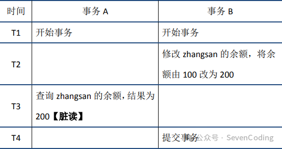
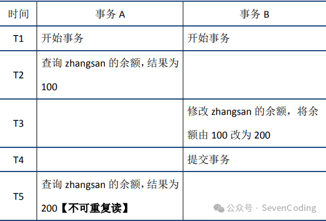
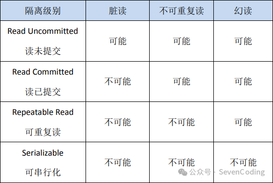

# 事务的四个特性ACID
+ 原子性（Atomicity）：语句要么全执行，要么全不执行，是事务最核心的特性，事务本身就是以原子性来定义的；实现主要基于undo log
+ 持久性（Durability）：保证事务提交后不会因为宕机等原因导致数据丢失；实现主要基于redo log
+ 隔离性（Isolation）：数据库允许多个并发事务同时对其数据进行读写和修改的能力，隔离性保证事务执行尽可能不受其他事务影响；InnoDB默认的隔离级别是RR，RR的实现主要基于锁机制（包含next-key lock）、MVCC（包括数据的隐藏列、基于undo log的版本链、ReadView）
+ 一致性（Consistency）：事务追求的最终目标，是指事务操作前和操作后，数据满足完整性约束，数据库保持一致性状态。一致性的实现既需要数据库层面的保障，也需要应用层面的保障
# 并发事务中可能存在的问题
## 脏读
当前事务(A)中可以读到其他事务(B)未提交的数据（脏数据），这种现象是脏读。举例如下（以账户余额表为例）：

# 不可重复读
在事务A中先后两次读取同一个数据，两次读取的结果不一样，这种现象称为不可重复读，读取到了其它事务已提交的数据。脏读与不可重复读的区别在于：前者读到的是其他事务未提交的数据，后者读到的是其他事务已提交的数据。举例如下：
# 幻读
在事务A中按照某个条件先后两次查询数据库，两次查询结果的条数不同，这种现象称为幻读。不可重复读与幻读的区别可以通俗的理解为：前者是数据变了，后者是数据的行数变了。举例如下：

三者严重性程度依次下降
# 事务的隔离级别 - 即隔离性

# InnoDB可重复读可以尽量避免幻读
MySQL InnoDB 引擎的默认隔离级别虽然是可重复读，但是它很大程度上避免幻读现象（但并不是完全解决了），解决的方案有两种：