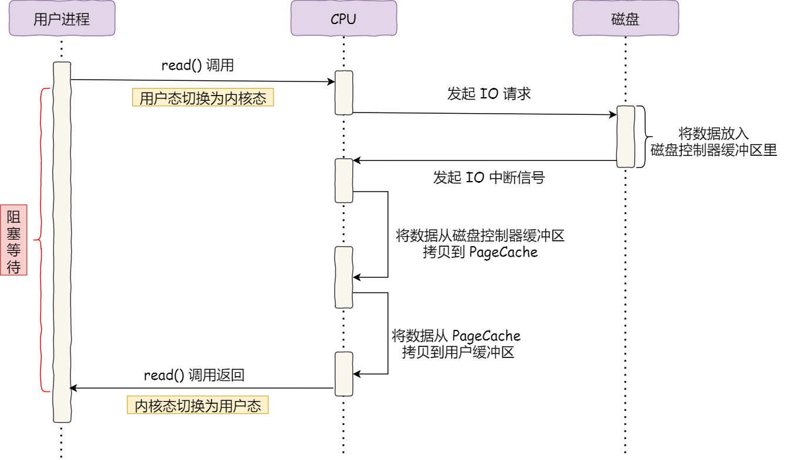
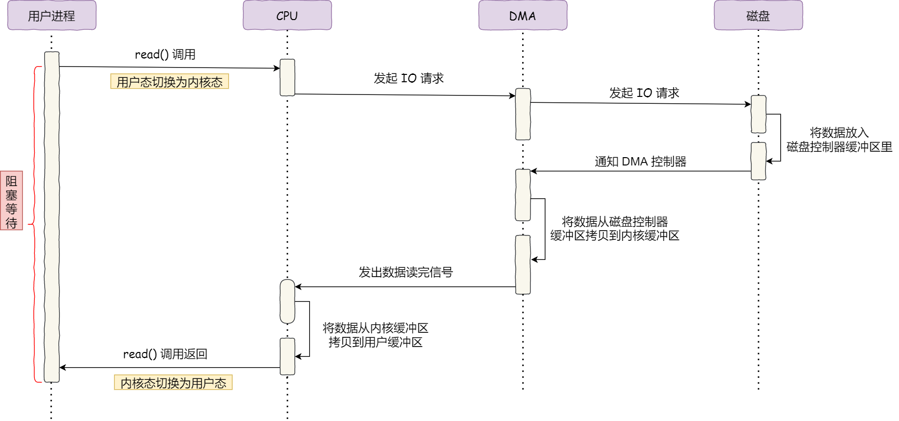
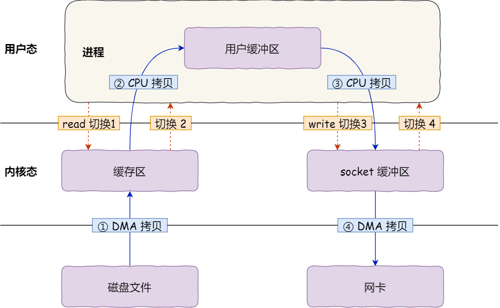
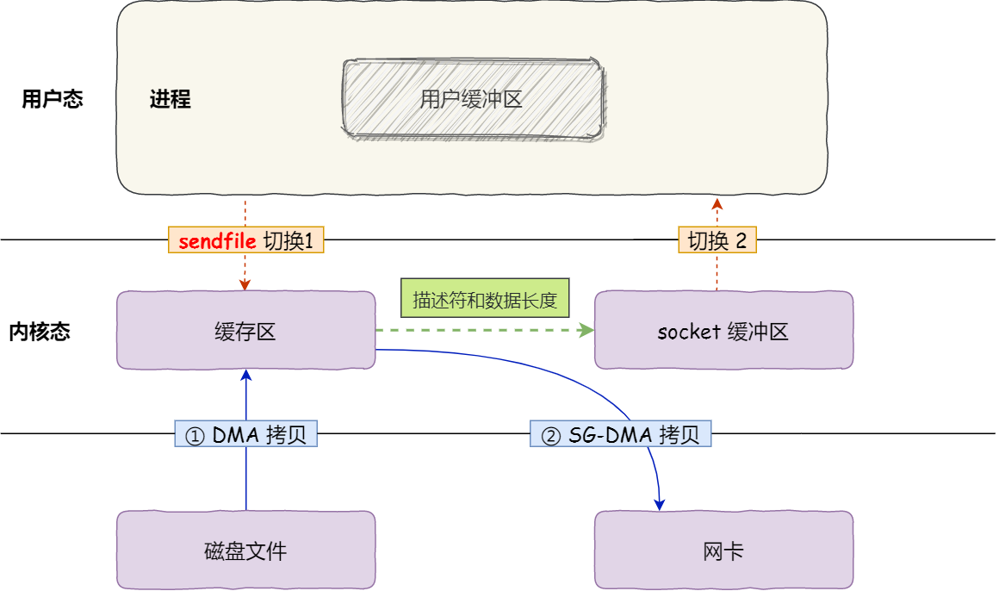

# 没有DMA技术之前


 可以看出来涉及到内核上下文的步骤都需要cpu参与  
 tips:在现代 Linux 系统中，pagecache 实际上已经和 buffer cache 合并了。也就是说，传统的 buffer cache 已经被整合进 pagecache 中。
## 有了dma之后


## 网络文件传输中发生了什么
``` java
read(file, tmp_buf, len);
write(socket, tmp_buf, len);
```

发生了四次上下文切换，上下文切换到成本并不小，一次切换需要耗时几十纳秒到几微秒，虽然时间看上去很短，但是在高并发的场景下，这类时间容易被累积和放大，从而影响系统的性能。

### 如何优化文件传输的性能？
**先来看看，如何减少「用户态与内核态的上下文切换」的次数呢？**
零拷贝技术实现的方式通常有 2 种：

mmap + write
sendfile
### mmap + write
用 mmap() 替换 read() 系统调用函数。
mmap() 系统调用函数会直接把内核缓冲区里的数据「映射」到用户空间，这样，操作系统内核与用户空间就不需要再进行任何的数据拷贝操作。
### sendfile
提供了一个专门发送文件的系统调用函数 sendfile()


这就是所谓的零拷贝（Zero-copy）技术，因为我们没有在内存层面去拷贝数据，也就是说全程没有通过 CPU 来搬运数据，所有的数据都是通过 DMA 来进行传输的。

# kafka和nginx都默认有零拷贝技术

# 但是，内存空间远比磁盘要小，内存注定只能拷贝磁盘里的一小部分数据。
那问题来了，选择哪些磁盘数据拷贝到内存呢？
所以通常，刚被访问的数据在短时间内再次被访问的概率很高，于是我们可以用 PageCache 来缓存最近被访问的数据，当空间不足时淘汰最久未被访问的缓存。
记住 pagecache本质是RAM

# 超大文件pagecache失效
绕开 PageCache 的 I/O 叫直接 I/O
使用 PageCache 的 I/O 则叫缓存 I/O
在 MySQL 数据库中，可以通过参数设置开启直接 I/O，默认是不开启；